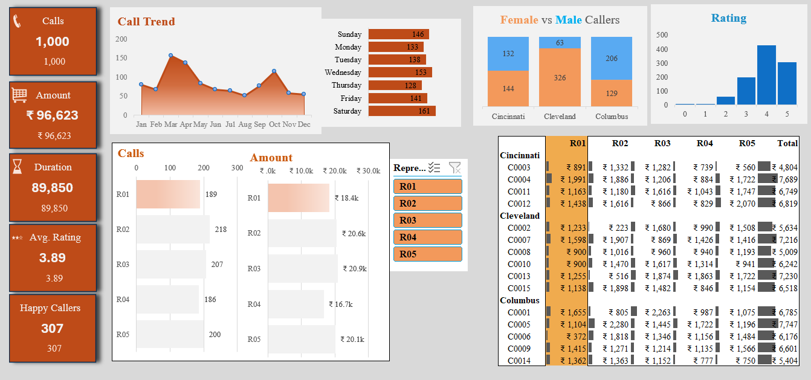
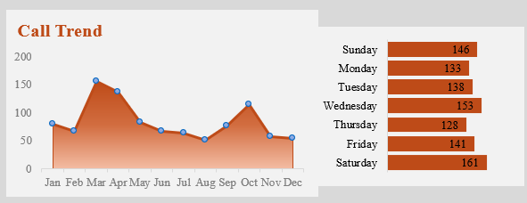
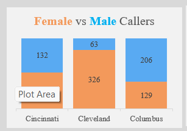
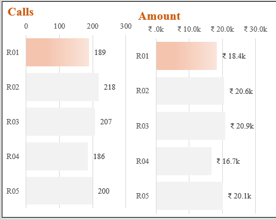
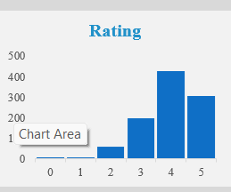
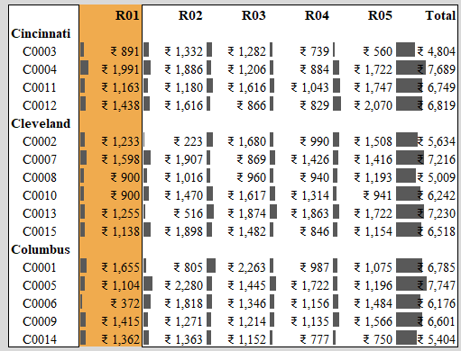

# Call Center Performance Dashboard (Excel)

## Overview
This project is an interactive Excel dashboard designed to analyze call center performance across multiple dimensions such as call volume, revenue generation, customer satisfaction, and agent performance.

---

## Objectives
- Track monthly call trends  
- Analyze revenue (amount) generated  
- Evaluate agent performance  
- Understand customer satisfaction through ratings  
- Compare caller demographics (Male vs Female)

---

## Dashboard Preview

## Call Trend Analysis

## Caller Demographics

## Agent Performance

## Customer Ratings

## Sales Analysis

---

## Key Metrics
- **Total Calls:** 1,000  
- **Total Revenue:** ₹96,623  
- **Total Duration:** 89,850 mins  
- **Average Rating:** 3.89  
- **Happy Callers:** 307  

---

## Features
- Monthly Call Trend Analysis  
- Day-wise Call Distribution  
- Gender-based Caller Insights  
- Agent-wise Performance (R01–R05)  
- Revenue Contribution by Agents  
- Customer Rating Distribution  

---

## Tools Used
- Microsoft Excel  
- Pivot Tables  
- Pivot Charts  
- Slicers  
- Conditional Formatting  

---

## Key Insights
- Peak call volume observed in March and October  
- Cleveland region generates highest revenue  
- Agent R02 shows highest contribution in revenue  
- Majority ratings fall between 3 and 5 indicating moderate satisfaction  

---

